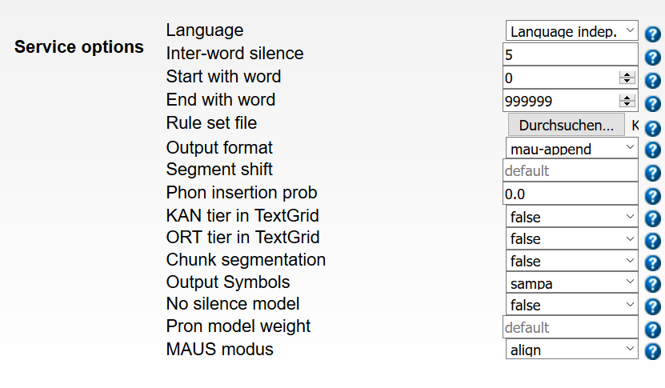

# LangDocMAUS

Tools for preparing Toolbox files for automatic forced alignment with WebMAUS and tools to integrate the results into Toolbox and ELAN files

General overview of the process:

1. Optionally export an ELAN file to Toolbox format or start with an existing Toolbox file

2. Convert Toolbox file to BAS Partitur Format for (Web)MAUS using Toolbox2BASPartitur.py and a supplied grapheme-to-phoneme rule file

3. Optionally check that all symbols created by the grapheme-to-phoneme conversion are contained in the MAUS sampa.inventory.list using CheckBASPartiturPhonemeInventory.py

4. Perform automatic forced alignment with (Web)MAUS
   
   In general, you should choose the following settings:
   

5. Integrate the alignment results from the resulting MAU (BAS Partitur Format) file back into the Toolbox file with MAU2Toolbox.py  
(Alternatively or additionally, create a TextGrid-File from the output of MAUS with MAU2TextGrid.py)

6. Optionally: Import the Toolbox file into ELAN

7. Flexibilize the ELAN file using flexibilize_imported_toolbox_in_elan.py in order to allow words to have their own start and end points on the time line

8. Set the correct word start and end times in the ELAN file using import_wordtimes_from_toolbox_to_elan.py

The whole process can be run semi-automatically using a batch file
like the one(s) in the folder example_batch_files.

Some example grapheme-to-phoneme rule files are contained in the folder
transliterationtables. The grammar is relatively simple:

"#" marks comment lines, which are ignored

Substitution rules have the format

    X --> Y

X is replaced by Y.

Deletion rules have the format

    X --

X is deleted.

The grapheme-to-phoneme rules usually have to decapitalize capitalized words,
delete punctuation marks, and convert graphemes (including digraphs and trigraphs)
into the set of SAMPA phonemes contained in sampa.inventory.list.
The rules also have to insert spaces around each individual SAMPA phoneme
(cf. the example transliteration tables).

If you have any questions, you can contact Jan Strunk (jan.strunk@uni-koeln.de).

## Scripts

All scripts are written in Python 3.

### CheckBASPartiturPhonemeInventory.py

python CheckBASPartiturPhonemeInventory.py BAS_FILE INVENTORY_FILE

Check whether all phonemes in the BAS Partitur file are contained
in the (Web)MAUS SAMPA inventory.

You can use the supplied inventory file sampa.inventory.list
(check sampa.inventory.txt for a human readable version).

### flexibilize_imported_toolbox_in_elan.py

Script to flexibilize an ELAN file created by importing a Toolbox file
in order to allow words to have their own start and end points on the time line

    usage: flexibilize_imported_toolbox_in_elan.py [-h] inputfilename outputfilename

    Make words in an ELAN file time-alignable after importing a Toolbox file.

    positional arguments:
        inputfilename   the name of the input ELAN file (created by importing a Toolbox file)
        outputfilename  the name of the output flexibilized ELAN file

    optional arguments:
        -h, --help      show this help message and exit

### import_wordtimes_from_toolbox_to_elan.py

Script to set the correct word start and end times in an ELAN file
that has been created by importing a Toolbox file and has subsequently
been flexibilized with flexibilize_imported_toolbox_in_elan.py

    usage: import_wordtimes_from_toolbox_to_elan.py [-h] [-reftier REFTIER]
                                                    [-texttier TEXTTIER]
                                                    [-wordstarttier WORDSTARTTIER]
                                                    [-wordendtier WORDENDTIER]
                                                    inputfilename toolboxfilename outputfilename

    Set word start and end times in an ELAN file using information supplied in a Toolbox file.

    positional arguments:
        inputfilename         the name of the input ELAN file (created by importing a Toolbox file)
        toolboxfilename       the name of the imported Toolbox file containing information
                              about word start and end times
        outputfilename        the name of the output ELAN file

    optional arguments:
        -h, --help                                show this help message and exit
        -reftier REFTIER, --reftier REFTIER       the name of the reference tier (defaults to ref)
        -texttier TEXTTIER, --texttier TEXTTIER   the name of the transcription tier containing
                                                  the words (defaults to t)
        -wordstarttier WORDSTARTTIER, --wordstarttier WORDSTARTTIER
                                                  the name of the tier containing the word start times
                                                  (defaults to WordBegin)
        -wordendtier WORDENDTIER, --wordendtier WORDENDTIER
                                                  the name of the tier containing the word end times
                                                  (defaults to WordEnd)

## MAUS2TextGrid.py

Convert the transcription in a BAS Partitur file with a MAU tier to the Praat
TextGrid format.

    usage: MAU2TextGrid.py [-h] [-inputenc INPUTENC] [-origenc ORIGENC]
                                [-outputenc OUTPUTENC] [-wave WAVE]
                                [-samplerate SAMPLERATE] [-debuglevel {0,1}]
                                inputfilename originalfilename outputfilename

    positional arguments:
        inputfilename         the name of the input BAS Partitur file with MAU tier
        originalfilename      the name of the original BAS Partitur file
        outputfilename        the name of the output Praat TextGrid file

    optional arguments:
        -h, --help                show this help message and exit
        -inputenc INPUTENC, --inputenc INPUTENC
                                  the input character encoding to be used for the BAS
                                  Partitur file with MAU tier (defaults to UTF-8)
        -origenc ORIGENC, --origenc ORIGENC
                                  the input character encoding to be used for the
                                  original BAS Partitur file (defaults to UTF-8)
        -outputenc OUTPUTENC, --outputenc OUTPUTENC
                                  the output character encoding to be used (defaults to UTF-8)
        -wave WAVE, --wave WAVE   the file name of the associated wave file
        -samplerate SAMPLERATE, --samplerate SAMPLERATE
                                  the sample rate of the associated wave file in Hz
        -debuglevel {0,1}, --debuglevel {0,1}
                                  the debug level to be used (0 --> no status messages,
                                  1 --> print status messages)

### MAU2Toolbox.py

Convert the transcription in a BAS Partitur file with a MAU tier to the
Toolbox format.

    usage: MAU2Toolbox.py [-h] [-toolboxfile TOOLBOXFILE]
                          [-toolboxtype TOOLBOXTYPE] [-inputenc INPUTENC]
                          [-origenc ORIGENC] [-toolboxenc TOOLBOXENC]
                          [-outputenc OUTPUTENC] [-wave WAVE]
                          [-samplerate SAMPLERATE] [-debuglevel {0,1}]
                          [-outputwordtimes] [-keeputterancetimes]
                          [-wordstarttier WORDSTARTTIER]
                          [-wordendtier WORDENDTIER] [-reftier REFTIER]
                          [-texttier TEXTTIER]
                          [-utterancestarttier UTTERANCESTARTTIER]
                          [-utteranceendtier UTTERANCEENDTIER]
                          inputfilename originalfilename outputfilename

    positional arguments:
        inputfilename         the name of the input BAS Partitur file with MAU tier
        originalfilename      the name of the original BAS Partitur file
        outputfilename        the name of the output Toolbox file

    optional arguments:
        -h, --help            show this help message and exit
        -toolboxfile TOOLBOXFILE, --toolboxfile TOOLBOXFILE
                              the name of a Toolbox file to which the time
                              information should be added (defaults to None)
        -toolboxtype TOOLBOXTYPE, --toolboxtype TOOLBOXTYPE
                              Toolbox database type to be used when creating a new
                              Toolbox file from scratch (defaults to Text)
       -inputenc INPUTENC, --inputenc INPUTENC
                              the input character encoding to be used for the BAS
                              Partitur file with MAU tier (defaults to UTF-8)
       -origenc ORIGENC, --origenc ORIGENC
                              the input character encoding to be used for the
                              original BAS Partitur file (defaults to UTF-8)
       -toolboxenc TOOLBOXENC, --toolboxenc TOOLBOXENC
                              the character encoding to be used for the original
                              Toolbox file (defaults to UTF-8)
       -outputenc OUTPUTENC, --outputenc OUTPUTENC
                              the output character encoding to be used (defaults to UTF-8)
       -wave WAVE, --wave WAVE
                              the file name of the associated wave file
       -samplerate SAMPLERATE, --samplerate SAMPLERATE
                              the sample rate of the associated wave file in Hz
       -debuglevel {0,1}, --debuglevel {0,1}
                              the debug level to be used (0 --> no status messages,
                              1 --> print status messages)
       -outputwordtimes, --outputwordtimes
                              output word start and end times into the Toolbox file
                             (otherwise they are omitted)
       -keeputterancetimes, --keeputterancetimes
                              keep the original utterance start and end times from
                              the Toolbox file (otherwise they are overwritten)
       -wordstarttier WORDSTARTTIER, --wordstarttier WORDSTARTTIER
                              the name of the tier to store the start times of words
                              (defaults to WordBegin)
       -wordendtier WORDENDTIER, --wordendtier WORDENDTIER
                              the name of the tier to store the end times of words
                              (defaults to WordEnd)
       -reftier REFTIER, --reftier REFTIER
                              the name of the reference tier (under which utterance
                              start and end times will be added) (defaults to ref)
       -texttier TEXTTIER, --texttier TEXTTIER
                              the name of the tier to write the words to when
                              creating a new Toolbox file from scratch (defaults to t)
       -utterancestarttier UTTERANCESTARTTIER, --utterancestarttier UTTERANCESTARTTIER
                              the name of the tier to store the start times of
                              utterances (defaults to ELANBegin)
       -utteranceendtier UTTERANCEENDTIER, --utteranceendtier UTTERANCEENDTIER
                              the name of the tier to store the end times of
                              utterances (defaults to ELANEnd)

## Toolbox2BASPartitur.py

Convert the transcription in a Toolbox file (or parts thereof) to the BAS
Partitur format.

    usage: Toolbox2BASPartitur.py [-h] -t T -r R [-inputenc INPUTENC]
                                  [-outputenc OUTPUTENC] [-transenc TRANSENC]
                                  [-start START | -startid STARTID]
                                  [-end END | -endid ENDID] [-wave WAVE]
                                  [-samplerate SAMPLERATE] [-channels {1,2}]
                                  [-bitdepth BITDEPTH] [-debuglevel {0,1}]
                                  [-starttimemarker STARTTIMEMARKER]
                                  [-endtimemarker ENDTIMEMARKER]
                                  inputfilename outputfilename
                                  transliterationfilename

    positional arguments:
        inputfilename             the name of the input Toolbox file
        outputfilename            the name of the output BAS Partitur file
        transliterationfilename   the name of the transliteration table file

    optional arguments:
        -h, --help            show this help message and exit
        -t T, --t T           the name of the transcription tier marker in the Toolbox file
        -r R, --r R           the name of the record marker in the Toolbox file
        -inputenc INPUTENC, --inputenc INPUTENC
                              the input character encoding to be used (defaults to UTF-8)
        -outputenc OUTPUTENC, --outputenc OUTPUTENC
                              the output character encoding to be used (defaults to UTF-8)
        -transenc TRANSENC, --transenc TRANSENC
                              the character encoding to be used for the
                              transliteration table (defaults to UTF-8)
        -start START, --start START
                              the number of the first record to be processed
        -startid STARTID, --startid STARTID
                              the record ID of the first record to be processed
        -end END, --end END   the number of the last record to be processed
        -endid ENDID, --endid ENDID
                              the record ID of the last record to be processed
        -wave WAVE, --wave WAVE
                              the file name of the associated wave file
        -samplerate SAMPLERATE, --samplerate SAMPLERATE
                              the sample rate of the associated wave file in Hz
        -channels {1,2}, --channels {1,2}
                              the number of channels of the associated wave file
                              (1=mono or 2=stereo)
        -bitdepth BITDEPTH, --bitdepth BITDEPTH
                              the bit depth of the associated wave file (in bytes)
        -debuglevel {0,1}, --debuglevel {0,1}
                              the debug level to be used (0 --> no status messages,
                              1 --> print status messages)
        -starttimemarker STARTTIMEMARKER, --starttimemarker STARTTIMEMARKER
                              the name of the Toolbox tier containing the start
                              times of utterances, which will be used to constrain
                              the automatic time alignment
        -endtimemarker ENDTIMEMARKER, --endtimemarker ENDTIMEMARKER
                              the name of the Toolbox tier containing the end times
                              of utterances, which will be used to constrain the
                              automatic time alignment
